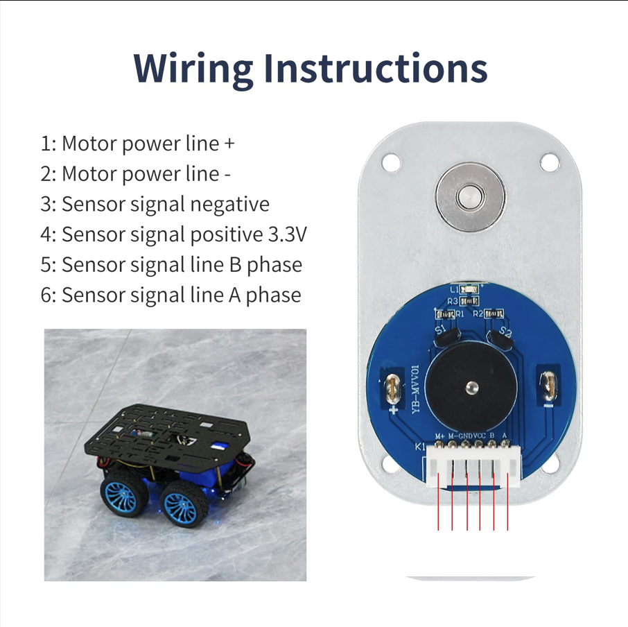

| **Motor**                                                              |                                      |
| ---------------------------------------------------------------------- | ------------------------------------ |
| L-Typ GM3865-520 12V DC Motor mit Encoder                              |                                      |
| ---------------------------------------------------------------------- | ------------------------------------ |
| Motorspannung:                                                         | 12 V                                 |
| Sperrmoment:                                                           | 10 kg*cm                             |
| Nenndrehmoment:                                                        | 4,4 kg*cm                            |
| Drehzahl vor Getriebe:                                                 | 12.0000 U/min                        |
| Drehzahl nach Getriebe:                                                | 300 U/min                            |
| Übersetzungsverhältnis:                                                | 1:40                                 |
| Nennleistung:                                                          | 6 W                                  |
| Sperrstrom:                                                            | 4 A                                  |
| Nennstrom:                                                             | 0,5 A                                |
| Encodertyp:                                                            | AB Phasen-inkremental-Hall-Encoder   |
| Anzahl der Magnetringlinien:                                           | 11 zeilig                            |
| Encoder-Versorgungsspannung:                                           | 3,3 V                                |
| Schnittstellentyp:                                                     | PH2.0-6P                             |
| FUnktion:                                                              | MCU kann Signalimpulse direkt lesen. |
## Beschreibung des Encoder-Ausgangs
Die Phasendifferenz zwischen den beiden Signalen beträgt
100°. Die Drehrichtung des Motors lässt sich anhand der
Reihenfolge der beiden Signale bestimmen. Die aktuelle
Reifenfahrstrecke lässt sich anhand der Anzahl der
Signalimpulse pro Zeiteinheit und des Reifenumfangs berech-
non.
Erkennt man nur die Anzahl der AB-Phasenimpulse pro
Zeiteinheit, lässt sich auch die aktuelle Motordrehzahl
messen.

Nehmen wir als Beispiel einen Motor mit einem
Untersetzungsverhältnis von 1:40. Bei einer Umdrehung gibt
der Motor 11 Impulse pro Phase aus. Bei einem
Untersetzungsverhältnis von 1:40 beträgt die maximale
Leistung der Motorabtriebswelle (40*11*4)=1760 Impulse pro
Umdrehung. Die Phasendifferenz zwischen dem
AB-Zweiphasen-Ausgangsimpulssignal beträgt 100° und
ermöglicht so die Erkennung der Motordrehrichtung.

## Motor Wiring

ICM-20948 Modul, 3-Achsen-Accelerometer, Gyroskop und -Magnetometer, 9DOF, I2C, SPI, MPU-9250 Upgrade

raspberry pi installation
sudo apt install screen tio
